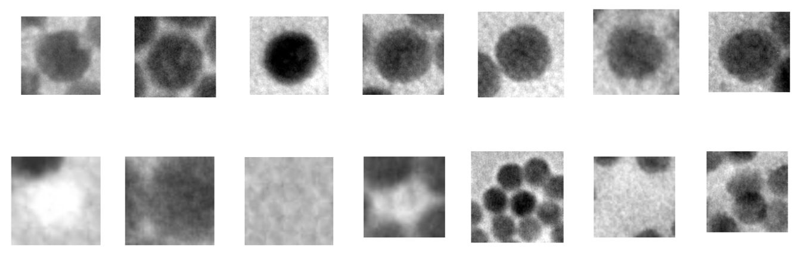
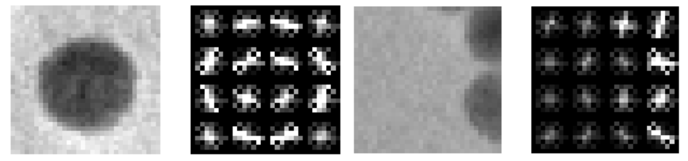
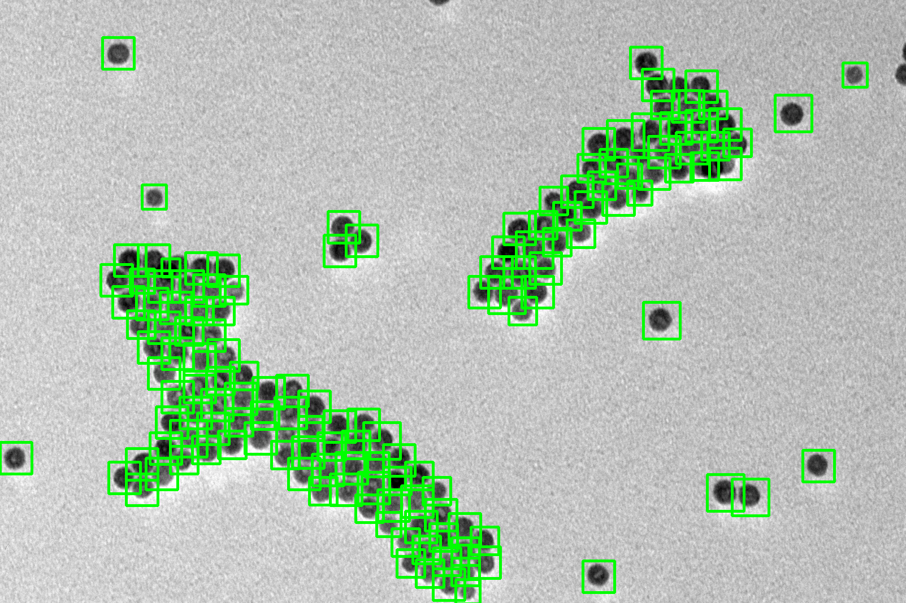
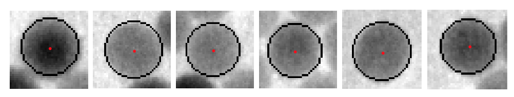
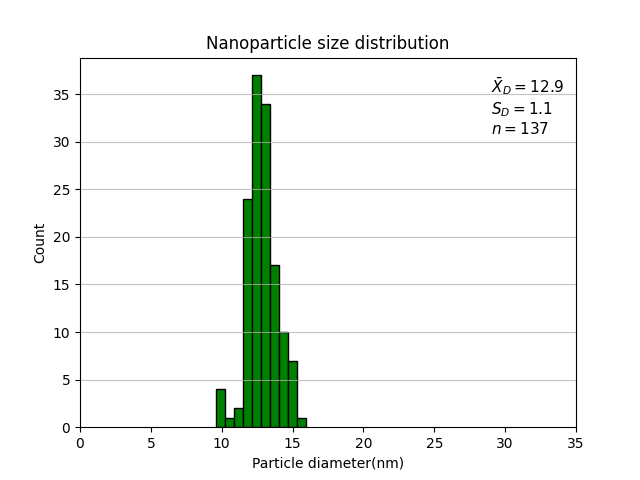
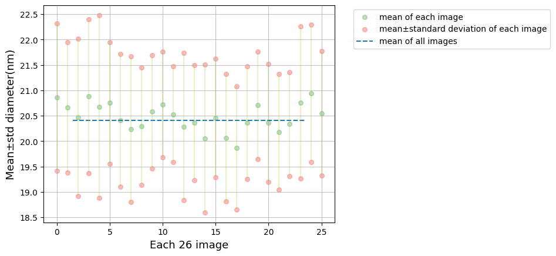
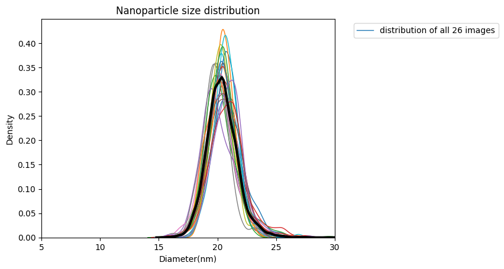

# Nanoparticle-Size-Distribution

This is an automatic approach for obtaining the nanoparticle size distributions output with the nanoparticle samples transmission electron microscopy(TEM) images as input. Three main steps are demonstrated as follows: 
- Firstly, machine learning based method is applied to detect nanoparticle in an image. The Histogram of Oriented Gradients (HOG) is used as features and Support Vector Machines (SVM) as the classifier to detect nanoparticle in given image. 
- Then RANSAC algorithm is used to measure the size of each nanoparticle in the bounding boxes from the nanoparticle detection result.
- Finally, after measured by RANSAC algorithm, we gather the size of each nanoparticle and plot the nanoparticle size distribution. 

The programming language is python, the following libraries are required:

1. Scikit-learn (For implementing SVM)
2. Scikit-image (For HOG feature extraction; RANSAC algorithm)
3. OpenCV (For testing; image processing library)
4. Numpy (Matrix multiplication)
5. Imutils (For Non-maximum suppression)
6. Matplotlib (For distribution plot)

A training set should comprise of:

1. Positive images: these images should contain only the object you are trying to detect
2. Negative images: these images can contain anything except for the object you are detecting

The results of the trained nanoparticle detector on two test images(a positive and a negative samples) are as follows: Normal (Gray-scale image)> HOG descriptors

The original TEM image of nanoparticle samples.

After classifying with a trained SVM model and applying NMS the following result is achieved:

Implement RANSAC algorithm to measure size of nanoparticle in each bounding boxes.

Plot the nanoparticle size distribution.

As we intend to run a large amount of TEM images, the overall mean size and distribution between respective mean size and distribution are demonstrated. 

